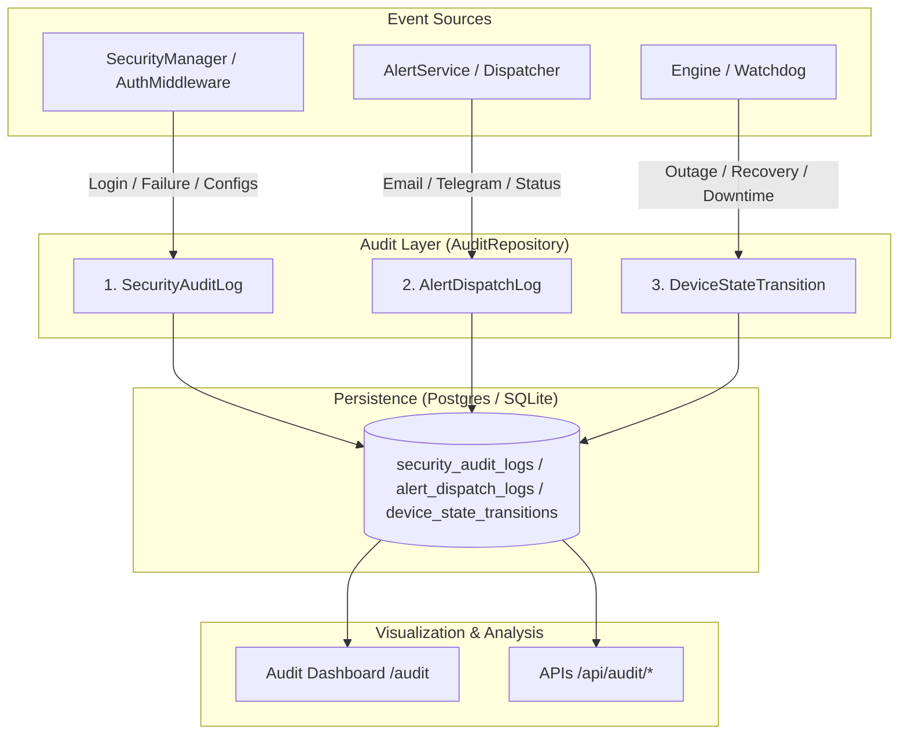

[📚 Documentation Hub](INDEX.md) > **Audit Trail & Observability**

---

# 🔍 Audit Trail & Observability: Noxfort Monitor™

This document outlines the compliance and audit trail subsystem of **Noxfort Monitor™ v2.0**, engineered to satisfy industrial regulatory standards, security access auditing, alert delivery verification (SLA), and hardware availability traceability.

---

## 1. The Three Audit Pillars

Noxfort Monitor segregates audit records into three independent, immutable streams ([`internal/domain/audit.go`](../internal/domain/audit.go)):

---

## 2. Audit Log Models in Detail

### 2.1 Security Audit (`SecurityAuditLog`)
Tracks all administrative actions and authentication attempts along with client IP addresses and UTC timestamps:

| Field | Type | Description |
| :--- | :--- | :--- |
| `id` | `int64` | Unique sequential identifier. |
| `created_at` | `time.Time` | Action record timestamp. |
| `username` | `string` | Username performing the action (or supplied during login attempt). |
| `action` | `string` | Standardized action identifier (see table below). |
| `details` | `string` | Contextual details (e.g., modified settings, deleted device ID). |
| `ip_address` | `string` | IP address of the requesting client. |

#### Common Security Actions:
* `AUTH_LOGIN_SUCCESS`: Login with valid credentials.
* `AUTH_LOGIN_FAILED`: Failed login attempt with incorrect username or password.
* `AUTH_LOGOUT`: Voluntary session termination.
* `USER_CREATED` / `USER_DELETED`: Operator account management.
* `SETTINGS_UPDATED`: Modification of notification channels (SMTP, Telegram, Ngrok).
* `DATABASE_SWITCHED`: Dynamic database switching between SQLite and PostgreSQL.
* `DEVICE_DELETED`: Removal of a device from the monitoring registry.

### 2.2 Alert Dispatch Audit (`AlertDispatchLog`)
Guarantees delivery traceability to ensure compliance with **incident response SLAs**:

| Field | Type | Description |
| :--- | :--- | :--- |
| `id` | `int64` | Sequential identifier. |
| `telemetry_id` | `*int64` | Optional ID of the telemetry event that triggered the alert. |
| `channel` | `string` | Notification channel: `EMAIL` or `TELEGRAM`. |
| `recipient` | `string` | Target destination (operator email or Telegram `chat_id`). |
| `role` | `string` | Recipient role (`TECHNICIAN`, `PROGRAMMER`, `ADMIN`). |
| `status` | `string` | `SENT` (successfully delivered), `FAILED` (API/SMTP error), or `SKIPPED`. |
| `error_reason` | `string` | Error message returned by SMTP server or Telegram API upon failure. |
| `dispatched_at`| `time.Time` | Exact timestamp when the notification was dispatched. |

### 2.3 Hardware State Transitions (`DeviceStateTransition`)
Calculates and formally records equipment downtime:

| Field | Type | Description |
| :--- | :--- | :--- |
| `id` | `int64` | Sequential identifier. |
| `device_identifier` | `string` | Target system identifier (e.g., `synapse`, `pump-01`). |
| `previous_state` | `string` | Previous state: `ONLINE` or `OFFLINE`. |
| `new_state` | `string` | Newly detected state: `OFFLINE` or `ONLINE`. |
| `duration_offline_sec` | `int64` | Total duration (in seconds) the system was unresponsive prior to recovery. |
| `transition_at` | `time.Time` | Exact timestamp of the state transition. |

---

## 3. Web Dashboard Visualization (`/audit`)

The web view at `/audit` organizes records into intuitive visual tabs for operators and auditors:
* **Visual Status Badges**: Clear status badges (`FAILED` in red, `SENT` in green, `OFFLINE` in orange).
* **Downtime Formatting**: Human-readable downtime durations (e.g., `12m 45s`).
* **Access Control**: Restricted to authenticated users with authorized administrative roles.

---

## 4. Audit REST API Endpoints

All audit routes return structured JSON responses for SIEM integration and BI dashboards:

| Method | Endpoint | Parameters | Description |
| :--- | :--- | :--- | :--- |
| `GET` | `/api/audit/security` | `limit` (default: 100) | Returns recent security and authentication event logs. |
| `GET` | `/api/audit/alerts` | `limit` (default: 100) | Returns notification dispatch history and delivery statuses. |
| `GET` | `/api/audit/transitions` | `limit` (default: 100) | Returns device availability history and calculated downtime durations. |

---

### 🔗 Related Documentation
* 🏗️ [System Architecture](../ARCHITECTURE.md) — Watchdog Engine and State Manager overview
* 🔐 [Security & RBAC](SECURITY.md) — Authentication events and route protection
* 🗄️ [Database & Persistence](DATABASE.md) — Audit tables and indexing in Postgres and SQLite
* 📡 [API Reference](API_REFERENCE.md) — Technical specifications of JSON endpoints
* 🖥️ [Desktop Application](DESKTOP_APP.md) — Desktop client integration
