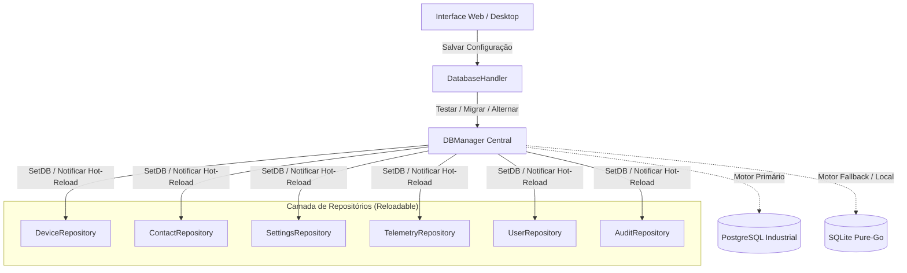
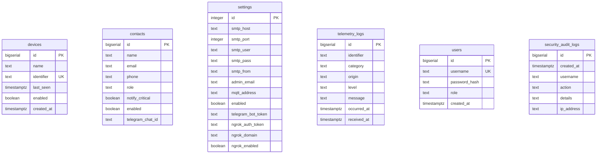

[📚 Central de Documentação](INDEX.md) > **Banco de Dados & Persistência Dual-Engine**

---

# 🗄️ Persistência & Arquitetura Dual-Engine: Noxfort Monitor™

Este documento descreve a arquitetura de persistência do **Noxfort Monitor™ v2.0**, cobrindo o suporte nativo e simultâneo a **PostgreSQL** e **SQLite**, o gerenciador de conexões a quente ([`DBManager`](../internal/storage/db_manager.go)), o migrador automático de dados ([`MigrateData`](../internal/storage/migrator.go)), o provisionamento seguro de schemas e o adaptador de dialeto SQL em tempo de execução.

---

## 1. Visão Geral da Arquitetura Dual-Engine

O Noxfort Monitor foi concebido para atender tanto a instalações industriais leves e isoladas (edge/offline) quanto a ambientes corporativos distribuídos e redundantes. Para isso, adota um modelo **Dual-Engine**:



### Motores Suportados

| Recurso | SQLite (Pure-Go) | PostgreSQL |
| :--- | :--- | :--- |
| **Driver Go** | `modernc.org/sqlite` (sem CGO) | `github.com/lib/pq` |
| **Caso de Uso** | Instalações locais, desktop monousuário, testes | Servidores industriais, alta concorrência, multi-nós |
| **Localização Padrão** | `~/Documentos/Monitor/monitor_logs.db` | Servidor TCP (padrão porta `5432`) |
| **Isolamento** | Arquivo único de banco local | Schema dedicado (`schema_monitor` ou customizado) |
| **Dependências Externas** | Nenhuma (embutido no binário) | Servidor PostgreSQL 12+ em rede |

---

## 2. Inicialização e Ciclo de Fallback Automático

No arranque da aplicação ([`cmd/server/main.go`](../cmd/server/main.go)), o sistema lê as configurações persistidas em disco via `storage.LoadDatabaseConfig()`.

1. **Tentativa PostgreSQL**:
   - Se a configuração apontar para `postgres`, o sistema tenta conexão com timeout seguro via `storage.OpenConnection(dbConfig)`.
   - Caso a conexão seja bem-sucedida, o sistema executa `storage.InitPostgresSchema(pgDB, schemaName)` para garantir a existência do schema e tabelas.
2. **Fallback Automático para SQLite**:
   - Se o PostgreSQL estiver offline, recusar conexão ou falhar na validação do schema, o sistema registra um aviso no log e imediatamente inicializa o **SQLite local** como fallback de segurança.
   - O monitor **nunca deixa de iniciar** por indisponibilidade de rede ou do PostgreSQL.

---

## 3. O Gerenciador Dinâmico (`DBManager`) & Hot-Reload

Tradicionalmente, a troca de banco exige reiniciar o processo do servidor. No Noxfort Monitor, o [`DBManager`](../internal/storage/db_manager.go) gerencia a conexão ativa e permite **hot-reload a quente**:

```go
type ReloadableRepository interface {
    SetDB(db *sql.DB, driver string)
}
```

### Como Funciona o Hot-Reload:
1. Todos os repositórios (`DeviceRepository`, `ContactRepository`, `SettingsRepository`, `TelemetryRepository`, `UserRepository`, `AuditRepository`) implementam a interface `ReloadableRepository`.
2. Ao iniciar, os repositórios são registrados no `DBManager`:
   ```go
   dbManager.RegisterRepository(deviceRepo)
   dbManager.RegisterRepository(contactRepo)
   // ...
   ```
3. Quando o administrador altera o banco via tela `/server` ou API `/api/settings/database/save`:
   - O `DBManager` valida a nova conexão.
   - Se o usuário solicitou migração, os dados são transferidos com integridade.
   - O `DBManager` adquire um lock de escrita (`sync.RWMutex`), atualiza a referência `*sql.DB` e invoca `SetDB(newDB, driver)` em todos os repositórios registrados.
   - A conexão antiga é drenada e fechada de forma limpa.
   - **Nenhum serviço é reiniciado**, e os listeners MQTT e HTTP continuam operando normalmente sem perda de pacotes.

---

## 4. Migrador Automático de Dados (`MigrateData`)

O módulo [`internal/storage/migrator.go`](../internal/storage/migrator.go) implementa a sincronização segura entre bancos heterogêneos.

### Entidades Migradas:
1. **Dispositivos (`devices`)**: Nome, identificador de origem (`identifier`), último heartbeat (`last_seen`) e status de monitoramento (`enabled`).
2. **Contatos (`contacts`)**: Nome, email, telefone, cargo/função (`role`), preferências de alerta (`notify_critical`, `enabled`) e Telegram Chat ID.
3. **Configurações Globais (`settings`)**: Configurações de SMTP, MQTT broker, token e domínio do Ngrok, switch mestre de alertas.
4. **Usuários e Operadores (`users`)**: Contas de acesso com seus respectivos hashes criptográficos e privilégios RBAC.

A migração utiliza transações e cláusulas de conflito para garantir **idempotência** (não duplicar registros já presentes no banco de destino).

---

## 5. Dialetos & O Adaptador de Consultas (`AdaptQuery`)

O código SQL do core do Monitor foi projetado para manter uma única base de código compartilhada entre SQLite e PostgreSQL, sem necessidade de ORMs pesados.

O [`QueryAdapter`](../internal/storage/query_adapter.go) inspeciona as consultas em tempo de execução:
* **Placeholders de Parâmetros**: Converte interrogações `?` (padrão SQLite) para índices posicionais `$1, $2, $3...` quando o driver ativo for `postgres`. Ignora ocorrências literais dentro de aspas simples.
* **Cláusulas de Conflito**: Adapta sintaxes como `INSERT OR IGNORE INTO` para `INSERT INTO ... ON CONFLICT DO NOTHING`.

---

## 6. Provisionamento de Schemas e Usuários no PostgreSQL

### 6.1 Schema Idempotente (`InitPostgresSchema`)
O módulo de DDL ([`postgres_schema.go`](../internal/storage/postgres_schema.go)) assegura:
* Criação do schema seguro `CREATE SCHEMA IF NOT EXISTS "schema_monitor";`.
* Configuração do `search_path` da sessão.
* Criação das tabelas centrais: `devices`, `contacts`, `settings`, `telemetry_logs`, `users`.
* Criação das tabelas de auditoria: `security_audit_logs`, `alert_dispatch_logs`, `device_state_transitions`.
* Criação de índices para consultas rápidas por timestamp e identificador.

### 6.2 Provisionador Administrativo de Usuários (`ProvisionPostgresUser`)
Através de [`internal/storage/postgres_admin.go`](../internal/storage/postgres_admin.go), o administrador pode criar usuários dedicados com privilégios restritos diretamente pela interface web:
* Conecta temporariamente com a credencial administrativa informada (ex: `postgres`).
* Cria o novo usuário (`CREATE USER ... WITH PASSWORD ...`).
* Concede privilégios restritos apenas ao schema do Monitor (`GRANT USAGE ON SCHEMA ...`, `GRANT ALL PRIVILEGES ON ALL TABLES IN SCHEMA ...`).

---

## 7. Estrutura das Tabelas



---

### 🔗 Documentos Relacionados
* 🏗️ [Arquitetura Geral](../ARCHITECTURE.md) — Visão macro da separação em camadas
* 📡 [Referência de APIs](API_REFERENCE.md) — Endpoints REST de configuração e teste de banco
* 🚀 [Guia de Implantação em Produção](DEPLOYMENT.md) — Setup corporativo de PostgreSQL e serviços
* 🔐 [Segurança e RBAC](SECURITY.md) — Estrutura de contas e auditoria de alterações no banco
* 🔍 [Trilha de Auditoria](AUDIT_TRAIL.md) — Registro de logs e transições de persistência
