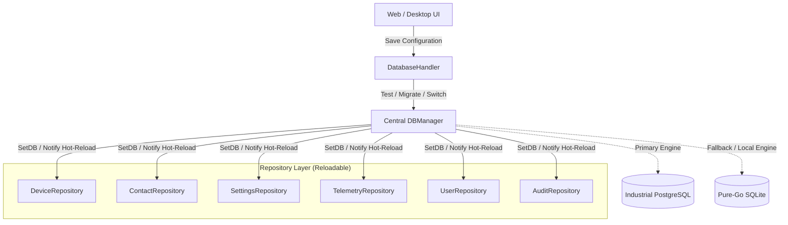
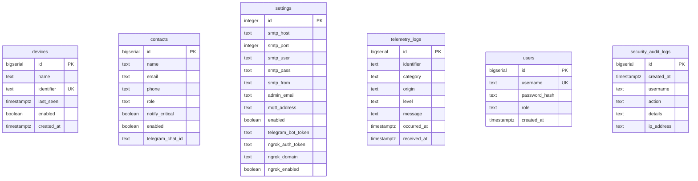

[📚 Documentation Hub](INDEX.md) > **Database & Dual-Engine Persistence**

---

# 🗄️ Persistence & Dual-Engine Architecture: Noxfort Monitor™

This document details the persistence architecture of **Noxfort Monitor™ v2.0**, covering native, concurrent support for **PostgreSQL** and **SQLite**, the live connection hot-reload manager ([`DBManager`](../internal/storage/db_manager.go)), the automated data migrator ([`MigrateData`](../internal/storage/migrator.go)), secure schema provisioning, and the runtime SQL dialect adapter.

---

## 1. Dual-Engine Architecture Overview

Noxfort Monitor is engineered to serve both lightweight, isolated industrial edge installations (offline/single-node) and distributed, redundant enterprise environments. To achieve this, it adopts a **Dual-Engine** design:



### Supported Engines

| Feature | SQLite (Pure-Go) | PostgreSQL |
| :--- | :--- | :--- |
| **Go Driver** | `modernc.org/sqlite` (CGO-free) | `github.com/lib/pq` |
| **Primary Use Case** | Local deployments, single-user desktop, testing | Industrial servers, high concurrency, multi-node clusters |
| **Default Location** | `~/Documentos/Monitor/monitor_logs.db` | TCP Server (default port `5432`) |
| **Isolation** | Single local database file | Dedicated schema (`schema_monitor` or custom) |
| **External Dependencies** | None (embedded in binary) | Network PostgreSQL 12+ server |

---

## 2. Bootstrapping and Automatic Fallback Lifecycle

During application startup ([`cmd/server/main.go`](../cmd/server/main.go)), the server loads persisted database configuration from disk via `storage.LoadDatabaseConfig()`.

1. **PostgreSQL Attempt**:
   - If configured for `postgres`, the system attempts a connection with a safe timeout via `storage.OpenConnection(dbConfig)`.
   - If connection succeeds, it runs `storage.InitPostgresSchema(pgDB, schemaName)` to ensure schemas and tables exist.
2. **Automatic Fallback to SQLite**:
   - If PostgreSQL is offline, refuses connection, or fails schema initialization, the system logs a warning and immediately initializes **local SQLite** as a fail-safe fallback.
   - The monitor **never fails to boot** due to network outages or remote PostgreSQL unavailability.

---

## 3. Dynamic Manager (`DBManager`) & Live Hot-Reload

Traditionally, switching database connections requires restarting the application process. In Noxfort Monitor, the [`DBManager`](../internal/storage/db_manager.go) manages the active connection and enables **runtime hot-reloading**:

```go
type ReloadableRepository interface {
    SetDB(db *sql.DB, driver string)
}
```

### How Hot-Reload Works:
1. All repositories (`DeviceRepository`, `ContactRepository`, `SettingsRepository`, `TelemetryRepository`, `UserRepository`, `AuditRepository`) implement the `ReloadableRepository` interface.
2. At boot, repositories register with `DBManager`:
   ```go
   dbManager.RegisterRepository(deviceRepo)
   dbManager.RegisterRepository(contactRepo)
   // ...
   ```
3. When an administrator switches database settings via the `/server` view or `/api/settings/database/save`:
   - `DBManager` validates the new connection parameters.
   - If data migration was requested, records are transferred with integrity checks.
   - `DBManager` acquires a write lock (`sync.RWMutex`), updates its `*sql.DB` handle, and calls `SetDB(newDB, driver)` across all registered repositories.
   - The previous connection pool is gracefully drained and closed.
   - **No processes are restarted**, and incoming MQTT and HTTP listeners continue processing packets without interruption.

---

## 4. Automated Data Migrator (`MigrateData`)

The [`internal/storage/migrator.go`](../internal/storage/migrator.go) module implements safe cross-engine data synchronization between heterogeneous database drivers.

### Migrated Entities:
1. **Devices (`devices`)**: Display name, source identifier (`identifier`), last heartbeat (`last_seen`), and monitoring flag (`enabled`).
2. **Contacts (`contacts`)**: Name, email, phone, operational role (`role`), notification preferences (`notify_critical`, `enabled`), and Telegram Chat ID.
3. **Global Settings (`settings`)**: SMTP parameters, MQTT broker address, Ngrok tokens/domain, and global alert dispatch toggle.
4. **Users & Operators (`users`)**: Operator accounts along with salted cryptographic hashes and RBAC privileges.

The migrator leverages database transactions and conflict resolution clauses to ensure **idempotency** (preventing duplicate entries in target databases).

---

## 5. SQL Dialects & Query Adapter (`AdaptQuery`)

Noxfort Monitor's SQL layer maintains a single shared codebase between SQLite and PostgreSQL without relying on heavy ORM frameworks.

The [`QueryAdapter`](../internal/storage/query_adapter.go) adapts queries at runtime:
* **Parameter Placeholders**: Translates standard SQLite question marks `?` into positional parameters `$1, $2, $3...` when PostgreSQL is active, while ignoring literal question marks inside single-quoted strings.
* **Conflict Clauses**: Adapts syntax such as `INSERT OR IGNORE INTO` to `INSERT INTO ... ON CONFLICT DO NOTHING`.

---

## 6. PostgreSQL Schema and User Provisioning

### 6.1 Idempotent Schema Initialization (`InitPostgresSchema`)
The DDL module ([`postgres_schema.go`](../internal/storage/postgres_schema.go)) guarantees:
* Secure schema creation: `CREATE SCHEMA IF NOT EXISTS "schema_monitor";`.
* Proper session `search_path` configuration.
* Creation of core tables: `devices`, `contacts`, `settings`, `telemetry_logs`, `users`.
* Creation of audit tables: `security_audit_logs`, `alert_dispatch_logs`, `device_state_transitions`.
* Fast B-tree indices for timestamps and device identifiers.

### 6.2 Administrative User Provisioning (`ProvisionPostgresUser`)
Via [`internal/storage/postgres_admin.go`](../internal/storage/postgres_admin.go), administrators can provision dedicated, least-privilege PostgreSQL users directly from the web dashboard:
* Temporarily connects using supplied administrative credentials (e.g., `postgres`).
* Creates the dedicated user account (`CREATE USER ... WITH PASSWORD ...`).
* Grants privileges scoped strictly to the Monitor schema (`GRANT USAGE ON SCHEMA ...`, `GRANT ALL PRIVILEGES ON ALL TABLES IN SCHEMA ...`).

---

## 7. Table Schemas



---

### 🔗 Related Documentation
* 🏗️ [System Architecture](../ARCHITECTURE.md) — Architectural layer separation overview
* 📡 [API Reference](API_REFERENCE.md) — REST endpoints for database configuration and health checks
* 🚀 [Production Deployment Guide](DEPLOYMENT.md) — Enterprise PostgreSQL and service setup
* 🔐 [Security & RBAC](SECURITY.md) — Account structure and database change auditing
* 🔍 [Audit Trail](AUDIT_TRAIL.md) — Logging and persistence state transitions
