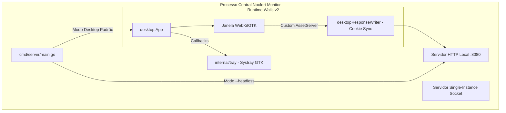

[📚 Central de Documentação](INDEX.md) > **Aplicação Desktop & Operação**

---

# 🖥️ Aplicação Desktop & Operação: Noxfort Monitor™

Este documento detalha a arquitetura da interface desktop nativa do **Noxfort Monitor™ v2.0** construída com **Wails v2**, a integração com **WebKitGTK**, o sistema de **Instância Única (Single-Instance)**, a **Bandeja do Sistema (Systray)**, o modo **Headless** para servidores e o fluxo de geração do pacote de instalação **Debian (`.deb`)**.

---

## 1. Visão Geral da Interface Desktop

O Noxfort Monitor combina a agilidade do desenvolvimento web com o desempenho e a integração nativa de um binário Go compilado. Em vez de depender de navegadores externos pesados (como Chromium ou Electron), o sistema utiliza **Wails v2** com **WebKitGTK** nativo do Linux.



### Características Técnicas:
* **Dimensões Padrão**: 1280x800 px (mínimo: 1024x600 px).
* **Política de GPU**: `linux.WebviewGpuPolicyOnDemand` para máxima economia de energia em estações industriais.
* **Minimizar ao Fechar**: `HideWindowOnClose: true`. Clicar no botão "X" da janela não encerra o servidor, apenas oculta a interface gráfica para a bandeja do sistema.

---

## 2. Controle de Instância Única (Single-Instance Lock)

Para evitar conflitos de portas de rede (MQTT `:1883`, HTTP `:8080`) e duplicação de instâncias no mesmo computador, o Monitor possui um sistema duplo de trava:

1. **Socket IPC Unix ([`internal/desktop/singleinstance.go`](../internal/desktop/singleinstance.go))**:
   - Antes de iniciar a interface gráfica, a função `desktop.TryActivateExisting()` tenta conectar a um socket Unix local (`/tmp/noxfort-monitor-singleinstance.sock`).
   - Se uma instância já estiver aberta, a nova instância envia uma mensagem de ativação ("`ACTIVATE`") e se encerra imediatamente com status `0`.
   - A instância em execução recebe o sinal no socket, traz sua janela para o primeiro plano e restaura o estado minimizado através de `desktopApp.RestoreWindow()`.
2. **Wails SingleInstanceLock**:
   - Uma camada secundária no runtime Wails garante integridade idêntica para o toolkit gráfico.

---

## 3. Integração com a Bandeja do Sistema (Systray)

O pacote [`internal/tray/tray.go`](../internal/tray/tray.go) integra-se diretamente ao loop de eventos do desktop através de `tray.Register()`:
* **Ícone Embutido**: O ícone oficial da Noxfort é compilado diretamente no executável Go via `//go:embed icon.png`.
* **Menu de Contexto**:
  * **Abrir Interface**: Restaura a janela gráfica e traz para o topo da área de trabalho.
  * **Encerrar / Sair**: Executa o encerramento gracioso (*graceful shutdown*), parando o Watchdog Engine, desconectando o broker MQTT, fechando o túnel Ngrok e liberando o banco de dados.

---

## 4. Modo Headless (Servidor / Daemon)

Em servidores de produção, contêineres Docker ou ambientes de nuvem sem servidor gráfico (sem X11 ou Wayland), tentar abrir janelas WebKit causará falha de inicialização (`cannot open display`).

Para rodar exclusivamente como servidor de segundo plano, execute com a flag:

```bash
# Via binário compilado:
./bin/noxfort-monitor --headless

# Ou utilizando o alias:
./bin/noxfort-monitor --server-only

# Via Makefile:
make run-headless
```

### O que o Modo Headless Faz:
1. Desativa a inicialização do Wails v2 e do WebKitGTK.
2. Desativa o servidor de socket IPC de janela.
3. Inicia o servidor HTTP, o cliente MQTT, o Watchdog Engine e o túnel Ngrok normalmente.
4. Aguarda sinais de terminação do sistema operacional (`SIGINT`, `SIGTERM`) para encerramento gracioso.

---

## 5. Empacotamento Debian (`.deb`)

O repositório inclui automação completa para gerar pacotes de distribuição para Ubuntu / Debian através do script [`build_installer.sh`](../build_installer.sh) ou pelo comando:

```bash
make deb
```

### O que o Instalador Gera:
1. **Compilação Otimizada**: Constrói o binário com tags `-tags "production,webkit2_41"` e flags `-ldflags="-s -w"` (stripping de símbolos de debug para reduzir tamanho).
2. **Ícones Multi-Resolução**: Gera ícones hicolor de 16x16 até 512x512 em `/usr/share/icons/hicolor/`.
3. **Instalação em `/opt`**: Copia o binário e templates web para `/opt/noxfort-monitor/`.
4. **Links Simbólicos**: Cria `/usr/local/bin/noxfort-monitor`.
5. **Integração no Menu do Sistema**: Instala `noxfort-monitor.desktop` no menu de aplicativos do GNOME/KDE.
6. **Autostart no Login**: Adiciona atalho em `/etc/xdg/autostart/` para inicialização automática no logon do usuário.
7. **Dependências do Sistema Declaradas**:
   ```control
   Depends: mosquitto, libayatana-appindicator3-1 | libappindicator3-1, libwebkit2gtk-4.1-0 | libwebkit2gtk-4.0-37, libgtk-3-0
   ```
8. **Scripts de Pós-Instalação**: Habilita e inicializa o serviço `mosquitto` automaticamente via systemd.

---

### 🔗 Documentos Relacionados
* 🏗️ [Arquitetura Geral](../ARCHITECTURE.md) — Modelo de concorrência e inicialização
* 🚀 [Guia de Implantação](DEPLOYMENT.md) — Configuração do serviço systemd headless
* 👨‍💻 [Guia de Desenvolvimento](DEVELOPER_GUIDES.md) — Dependências de compilação C/GTK
* 🔐 [Segurança e Sessões](SECURITY.md) — Sincronização de cookies na Webview
* 🌐 [Acesso Remoto](REMOTE_ACCESS.md) — Túnel Ngrok integrado à UI
