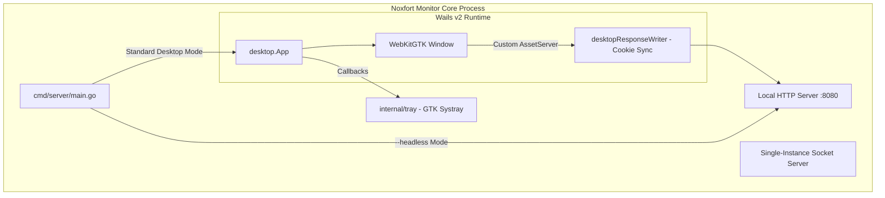

[📚 Documentation Hub](INDEX.md) > **Desktop Application & Operations**

---

# 🖥️ Desktop Application & Operations: Noxfort Monitor™

This document details the native desktop architecture of **Noxfort Monitor™ v2.0** built with **Wails v2**, its integration with **WebKitGTK**, the **Single-Instance** lock mechanism, the **System Tray (Systray)** lifecycle, **Headless** server mode, and the **Debian package (`.deb`)** generation pipeline.

---

## 1. Desktop Interface Overview

Noxfort Monitor combines the rapid iteration of web frontend technologies with the high performance and native integration of a compiled Go application. Rather than relying on resource-heavy browser runtimes (such as Chromium or Electron), the system leverages **Wails v2** with Linux-native **WebKitGTK**.



### Technical Specifications:
* **Default Dimensions**: 1280x800 px (minimum: 1024x600 px).
* **GPU Policy**: `linux.WebviewGpuPolicyOnDemand` for optimal energy efficiency on industrial workstations.
* **Minimize on Close**: `HideWindowOnClose: true`. Clicking the window close button ("X") does not terminate the backend server; it hides the GUI to the system tray.

---

## 2. Single-Instance Enforcement (IPC Lock)

To avoid network port collisions (MQTT `:1883`, HTTP `:8080`) and duplicated processes on the same host, Monitor uses a dual locking mechanism:

1. **Unix IPC Socket ([`internal/desktop/singleinstance.go`](../internal/desktop/singleinstance.go))**:
   - Before initializing the graphical UI, `desktop.TryActivateExisting()` attempts to connect to a local Unix domain socket (`/tmp/noxfort-monitor-singleinstance.sock`).
   - If an existing instance is running, the new process sends an activation command ("`ACTIVATE`") and exits cleanly with exit code `0`.
   - The active running instance receives the signal over the socket, un-minimizes its window, and brings it to the foreground via `desktopApp.RestoreWindow()`.
2. **Wails SingleInstanceLock**:
   - A secondary protection layer in the Wails runtime provides identical enforcement across window managers.

---

## 3. System Tray (Systray) Integration

The [`internal/tray/tray.go`](../internal/tray/tray.go) package integrates directly into the desktop event loop via `tray.Register()`:
* **Embedded Asset**: The official Noxfort icon is compiled into the Go binary via `//go:embed icon.png`.
* **Context Menu**:
  * **Open Dashboard**: Restores the graphical window and brings it to the top of the desktop workspace.
  * **Shutdown / Quit**: Triggers a clean graceful shutdown, stopping the Watchdog Engine, disconnecting from the MQTT broker, terminating the Ngrok tunnel, and releasing database connections.

---

## 4. Headless Server Mode (Daemon)

On production servers, Docker containers, or cloud environments without an active display server (no X11 or Wayland), attempting to launch WebKit windows will result in an initialization error (`cannot open display`).

To run exclusively as a background daemon, supply the headless flag:

```bash
# Via compiled binary:
./bin/noxfort-monitor --headless

# Or using the alias:
./bin/noxfort-monitor --server-only

# Via Makefile:
make run-headless
```

### What Headless Mode Does:
1. Disables Wails v2 and WebKitGTK window initialization.
2. Disables the IPC window activation socket server.
3. Initializes the HTTP server, MQTT client, Watchdog Engine, and Ngrok tunnel normally.
4. Listens for standard OS termination signals (`SIGINT`, `SIGTERM`) to perform a graceful shutdown.

---

## 5. Debian Packaging (`.deb`)

The repository includes automated scripts to package releases for Ubuntu / Debian via [`build_installer.sh`](../build_installer.sh) or the Makefile:

```bash
make deb
```

### What the Installer Bundles:
1. **Optimized Build**: Compiles the binary with `-tags "production,webkit2_41"` and `-ldflags="-s -w"` (stripping debug symbols to reduce binary size).
2. **Multi-Resolution Icons**: Installs hicolor icons from 16x16 up to 512x512 into `/usr/share/icons/hicolor/`.
3. **Installation in `/opt`**: Copies the binary and web templates into `/opt/noxfort-monitor/`.
4. **Symlink Generation**: Links `/usr/local/bin/noxfort-monitor`.
5. **Desktop Menu Integration**: Installs `noxfort-monitor.desktop` into GNOME/KDE application menus.
6. **Autostart on Login**: Places an entry in `/etc/xdg/autostart/` for automated startup upon user logon.
7. **Declared System Dependencies**:
   ```control
   Depends: mosquitto, libayatana-appindicator3-1 | libappindicator3-1, libwebkit2gtk-4.1-0 | libwebkit2gtk-4.0-37, libgtk-3-0
   ```
8. **Post-Installation Scripts**: Enables and starts the `mosquitto` systemd service automatically.

---

### 🔗 Related Documentation
* 🏗️ [System Architecture](../ARCHITECTURE.md) — Concurrency model and startup flow
* 🚀 [Deployment Guide](DEPLOYMENT.md) — Headless systemd service configuration
* 👨‍💻 [Developer Guide](DEVELOPER_GUIDES.md) — C/GTK compilation dependencies
* 🔐 [Security & Sessions](SECURITY.md) — Webview cookie synchronization
* 🌐 [Remote Access](REMOTE_ACCESS.md) — Ngrok tunnel integration with the UI
