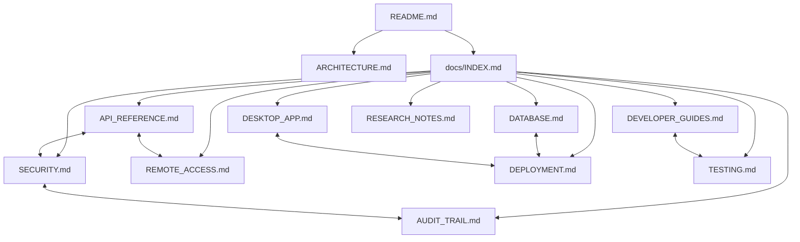

# 📚 Technical Documentation Hub: Noxfort Monitor™

Welcome to the technical documentation center for **Noxfort Monitor™ v2.0**. This library is organized around a **Knowledge Graph model (Obsidian / GitHub style)**, where each document is modular, in-depth, and comprehensively interconnected via bidirectional links.

---

## 🧭 Content Map (Knowledge Graph / MOC)

---

## 🗂️ Technical Guides Directory

### 1. Core & Architecture
* 🏗️ **[System Architecture](../ARCHITECTURE.md)**: Macro view of the Event-Driven Architecture (EDA), dependency injection in `cmd/server/main.go`, goroutine concurrency model, and SOLID layers.
* 📖 **[Project Overview (README)](../README.md)**: Executive summary, key features, quickstart setup, and AGPL v3 licensing.
* 🤝 **[Contributing Guide](../CONTRIBUTING.md)**: Go code standards, pull request workflow, and architectural rules.

### 2. Protocols & External Integration
* 📡 **[Complete API & Protocol Reference](API_REFERENCE.md)**:
  * MQTT ingestion via the native broker.
  * HTTP REST ingestion via `POST /api/telemetry`.
  * All routes for Authentication, Users, Tunnel, Database, and Audit.
* 🌐 **[Remote Access & Ngrok Tunnel](REMOTE_ACCESS.md)**:
  * Reverse tunnel architecture for traversing industrial firewalls and CGNAT.
  * WAN ingestion for remote agents (Synapse, Carina, edge nodes).
  * Static domain configuration and automatic startup at boot.

### 3. Persistence & Storage
* 🗄️ **[Database & Dual-Engine Persistence](DATABASE.md)**:
  * Coexistence and dynamic runtime switching between **PostgreSQL** and **SQLite**.
  * Live repository hot-reloading via `DBManager` without dropping connections.
  * Automatic heterogeneous data migrator (`MigrateData`).
  * Secure schema and user provisioning in PostgreSQL.
  * Runtime SQL dialect adapter (`QueryAdapter`).

### 4. Security & Governance
* 🔐 **[Security, Authentication & RBAC](SECURITY.md)**:
  * Access roles (`RoleAdmin` vs `RoleOperator`).
  * Session cookie lifecycle for `noxfort_session` and header-based token support.
  * Salted password hashing.
  * Idempotent superuser bootstrapping at boot via environment variables.
  * `AuthMiddleware` and smart interception (303 redirect vs 401 Unauthorized).
* 🔍 **[Audit Trail & Observability](AUDIT_TRAIL.md)**:
  * Security access traceability (`SecurityAuditLog`).
  * Alert delivery verification and SLA tracking (`AlertDispatchLog`).
  * Availability monitoring and downtime calculation (`DeviceStateTransition`).

### 5. Desktop Application & Packaging
* 🖥️ **[Desktop Application & Operations](DESKTOP_APP.md)**:
  * Wails v2 + WebKitGTK architecture for Linux.
  * Single-instance lock via Unix IPC socket (`desktop.TryActivateExisting`).
  * System tray (`internal/tray`), minimize-on-close, and graceful shutdown.
  * **Headless** server mode (`--headless` / `--server-only`) for screenless environments.
  * Packaging and distribution via Debian installer (`.deb`).

### 6. Engineering, Testing & Operations
* 🚀 **[Production Deployment Guide](DEPLOYMENT.md)**:
  * Systemd service configured in headless mode.
  * Direct installation via `.deb` package.
  * NGINX reverse proxy configuration with SSL termination.
* 👨‍💻 **[Developer Guide](DEVELOPER_GUIDES.md)**:
  * Local environment configuration (Go 1.22+, `libwebkit2gtk-4.1-dev`).
  * Dependency injection, channel extensions, and adding new entities.
* 🧪 **[Testing & Quality Assurance (QA)](TESTING.md)**:
  * Running unit tests with repository mocks.
  * Manual E2E testing with `mosquitto_pub` and `curl`.
  * Notification channel diagnostics (SMTP and Telegram).
* 🔬 **[Research Notes & Technical Decisions](RESEARCH_NOTES.md)**:
  * Decision log: CGO elimination, migration to Wails v2, and future clustering with gRPC.

---

### 🔗 Navigation Tips
* **On GitHub**: All links above use standard relative paths and work seamlessly in the web interface.
* **In Obsidian**: This `docs/` folder can be opened as a vault or viewed as a notes folder; the Graph View will reveal the full interconnection of the ecosystem.
