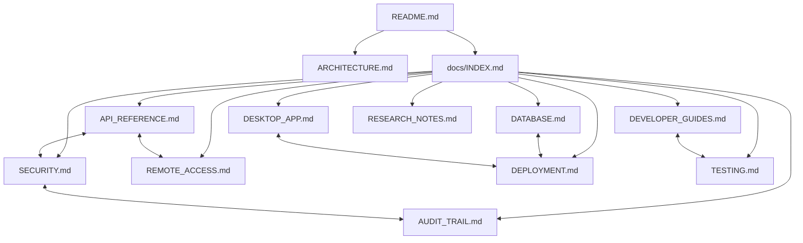

# 📚 Central de Documentação Técnica: Noxfort Monitor™

Bem-vindo ao centro de documentação técnica do **Noxfort Monitor™ v2.0**. Esta biblioteca foi organizada no modelo de **Grafo de Conhecimento (estilo Obsidian / GitHub)**, onde cada documento é modular, aprofundado e amplamente interconectado através de links bidirecionais.

---

## 🧭 Mapa de Conteúdo (Knowledge Graph / MOC)

---

## 🗂️ Diretório de Guias Técnicos

### 1. Núcleo & Arquitetura
* 🏗️ **[Arquitetura do Sistema](../ARCHITECTURE.md)**: Visão macro da arquitetura orientada a eventos (EDA), injeção de dependências no `cmd/server/main.go`, modelo de concorrência por goroutines e camadas SOLID.
* 📖 **[Visão Geral do Projeto (README)](../README.md)**: Resumo executivo, recursos principais, instalação rápida e licenciamento AGPL v3.
* 🤝 **[Guia de Contribuição](../CONTRIBUTING.md)**: Padrões de código Go, fluxo de pull requests e diretrizes arquiteturais.

### 2. Protocolos & Integração Externa
* 📡 **[Referência Completa de APIs & Protocolos](API_REFERENCE.md)**:
  * Ingestão MQTT via broker nativo.
  * Ingestão HTTP REST via `POST /api/telemetry`.
  * Todas as rotas de Autenticação, Usuários, Túnel, Banco de Dados e Auditoria.
* 🌐 **[Acesso Remoto & Túnel Ngrok](REMOTE_ACCESS.md)**:
  * Arquitetura do túnel reverso para atravessar firewalls e CGNAT industriais.
  * Ingestão WAN para agentes remotos (Synapse, Carina, nós de borda).
  * Configuração de domínio estático e auto-start no boot.

### 3. Persistência & Armazenamento
* 🗄️ **[Banco de Dados & Persistência Dual-Engine](DATABASE.md)**:
  * Coexistência e alternância dinâmica entre **PostgreSQL** e **SQLite**.
  * Hot-Reload de repositórios a quente via `DBManager` sem derrubar serviços.
  * Migrador automático de dados heterogêneos (`MigrateData`).
  * Provisionamento seguro de schemas e usuários no PostgreSQL.
  * O adaptador de dialetos SQL em tempo de execução (`QueryAdapter`).

### 4. Segurança & Governança
* 🔐 **[Segurança, Autenticação & RBAC](SECURITY.md)**:
  * Papéis de acesso (`RoleAdmin` vs `RoleOperator`).
  * Ciclo de vida do cookie de sessão `noxfort_session` e suporte a tokens via cabeçalho.
  * Criptografia de senhas com salt aleatório seguro.
  * Bootstrap idempotente do superusuário no boot via variáveis de ambiente.
  * O `AuthMiddleware` e interceptação inteligente (303 vs 401).
* 🔍 **[Trilha de Auditoria & Observabilidade](AUDIT_TRAIL.md)**:
  * Rastreabilidade de segurança (`SecurityAuditLog`).
  * Verificação de entrega de alertas e SLA (`AlertDispatchLog`).
  * Monitoramento de disponibilidade e cálculo de downtime (`DeviceStateTransition`).

### 5. Interface Gráfica & Empacotamento
* 🖥️ **[Aplicação Desktop & Operação](DESKTOP_APP.md)**:
  * Arquitetura Wails v2 + WebKitGTK para Linux.
  * Trava de instância única via socket IPC Unix (`desktop.TryActivateExisting`).
  * Bandeja do sistema (`internal/tray`), minimização ao fechar e graceful shutdown.
  * Modo **Headless** (`--headless` / `--server-only`) para servidores sem tela.
  * Empacotamento e distribuição via instalador Debian (`.deb`).

### 6. Engenharia, Testes & Operações
* 🚀 **[Guia de Implantação em Produção](DEPLOYMENT.md)**:
  * Serviço systemd configurado em modo headless.
  * Instalação direta via pacote `.deb`.
  * Configuração de proxy reverso com NGINX e certificados SSL.
* 👨‍💻 **[Guia do Desenvolvedor](DEVELOPER_GUIDES.md)**:
  * Configuração do ambiente local (Go 1.22+, `libwebkit2gtk-4.1-dev`).
  * Injeção de dependências, extensões de canais e adição de novas entidades.
* 🧪 **[Testes & Garantia de Qualidade (QA)](TESTING.md)**:
  * Execução de testes unitários com mocks de repositório.
  * Testes manuais E2E com `mosquitto_pub` e `curl`.
  * Diagnóstico de canais de notificação (SMTP e Telegram).
* 🔬 **[Notas de Pesquisa & Decisões Técnicas](RESEARCH_NOTES.md)**:
  * Histórico de decisões: eliminação de CGO, migração para Wails v2 e clustering futuro com gRPC.

---

### 🔗 Dicas de Navegação
* **No GitHub**: Todos os links acima utilizam caminhos relativos padrão e funcionam de forma nativa na interface web.
* **No Obsidian**: Esta pasta `docs/` pode ser aberta como um cofre (*vault*) ou visualizada como uma pasta de notas; o gráfico (*Graph View*) revelará a interconexão completa do ecossistema.
