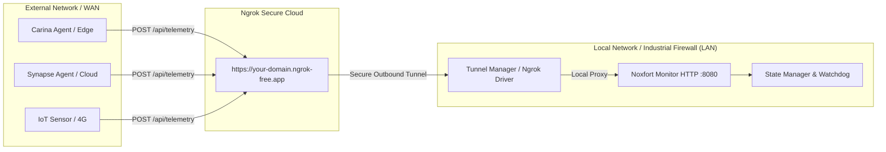

[📚 Documentation Hub](INDEX.md) > **Remote Access & Ngrok Ingestion**

---

# 🌐 Remote Access & Ingestion via Ngrok Tunnel: Noxfort Monitor™

This document details the WAN communication architecture of **Noxfort Monitor™ v2.0**, covering the secure reverse tunnel subsystem powered by **Ngrok**, public internet telemetry ingestion, and connecting remote edge agents (such as **Synapse**, **Carina**, or IoT nodes).

---

## 1. Why Remote Tunneling in Industrial Environments?

In industrial and distributed telemetry deployments, the central Monitor server frequently operates inside a local area network (LAN), behind **NAT** routers, cellular carrier **CGNAT**, or **strict corporate firewalls** that prevent inbound port forwarding.



With the tunnel subsystem, Noxfort Monitor establishes an encrypted TLS **outbound** connection (from inside to outside) to the Ngrok service, exposing a stable public endpoint without requiring a static public IP.

---

## 2. The Tunnel Abstraction Layer (`internal/tunnel`)

Adhering to the Dependency Inversion Principle (**DIP**), the transport layer does not couple directly to the Ngrok executable, but rather to decoupled interfaces ([`internal/tunnel/driver.go`](../internal/tunnel/driver.go)):

```go
type Service interface {
    Start(authToken, domain string) error
    Stop() error
    GetStatus() Status
    IsBinaryAvailable() bool
}
```

### Core Components:
1. **`NgrokDriver` ([`ngrok_driver.go`](../internal/tunnel/ngrok_driver.go))**:
   - Detects the presence of the `ngrok` executable in system `$PATH`.
   - Manages child process lifecycle (`ngrok http <port>`).
   - Polls Ngrok's local client API (`http://127.0.0.1:4040/api/tunnels`) to extract the generated public HTTPS URL and inspect errors in real time.
2. **`Manager` ([`manager.go`](../internal/tunnel/manager.go))**:
   - Maintains connection status in memory (`TunnelStatus`).
   - Automatically constructs the unified telemetry ingestion address:
     `https://your-domain.ngrok-free.app/api/telemetry`
3. **`TunnelHandler` ([`tunnel_handler.go`](../internal/transport/http/tunnel_handler.go))**:
   - Serves the `/remote` management UI and API control endpoints.

---

## 3. Configuration & Persistence

Tunnel configurations are stored directly in the `settings` table of the active database ([`domain.Settings`](../internal/domain/settings.go)):

| Parameter | JSON / DB Key | Description |
| :--- | :--- | :--- |
| **AuthToken** | `ngrok_auth_token` | Personal token obtained from the Ngrok dashboard. |
| **Static Domain** | `ngrok_domain` | Custom or reserved free domain (e.g., `your-monitor.ngrok-free.app`). |
| **Auto-Start** | `ngrok_enabled` | Boolean. If `true`, the tunnel starts automatically when the Monitor boots. |

### 3.1 Automatic Startup at Boot
During application initialization ([`cmd/server/main.go:L198`](../cmd/server/main.go#L198)), the server checks:
```go
if settings.NgrokEnabled && settings.NgrokAuthToken != "" {
    log.Printf("[BOOT] Auto-starting Ngrok Tunnel on domain '%s'...", settings.NgrokDomain)
    if err := tunnelManager.Start(settings.NgrokAuthToken, settings.NgrokDomain); err != nil {
        log.Printf("[WARN] Failed to auto-start Ngrok tunnel on boot: %v", err)
    }
}
```

---

## 4. Integration with Edge Nodes (Carina, Synapse, IoT)

When the tunnel is active, the Monitor dynamically adapts the operator interface:
1. On the **Monitored Systems** view (`/devices`), suggested ingestion commands update from local IP addresses (`192.168.x.x`) to the public HTTPS tunnel URL.
2. The **"Copy Address"** button copies the full endpoint ready to paste into client environment variables or configs.

### Remote Telemetry Dispatch Example via cURL
Remote nodes transmit events using standard HTTP POST:

```bash
curl -X POST "https://your-monitor.ngrok-free.app/api/telemetry" \
  -H "Content-Type: application/json" \
  -d '{
    "category": "HARDWARE",
    "origin": "carina-station-03",
    "level": "INFO",
    "message": "System OK - Telemetry over WAN",
    "occurred_at": "2026-09-05T14:30:00Z"
  }'
```

**Server Response**:
```json
{
  "status": "received"
}
```

---

## 5. Tunnel Control Endpoints

| Method | Endpoint | Privilege | Description |
| :--- | :--- | :--- | :--- |
| `GET` | `/remote` | Operator / Admin | Graphical web UI for tunnel management. |
| `GET` | `/api/tunnel/status` | Authenticated | Returns live status (`active`, `public_url`, `error`, etc.). |
| `POST` | `/api/tunnel/save` | Admin | Persists credentials and configuration flags to the database. |
| `POST` | `/api/tunnel/start` | Admin | Launches the tunnel process on demand. |
| `POST` | `/api/tunnel/stop` | Admin | Terminates the tunnel immediately. |

---

### 🔗 Related Documentation
* 🏗️ [System Architecture](../ARCHITECTURE.md) — Telemetry ingress pipeline overview
* 📡 [API Reference](API_REFERENCE.md) — Detailed specification of `POST /api/telemetry`
* 🗄️ [Database & Persistence](DATABASE.md) — Structure of the `settings` table
* 🔐 [Security & RBAC](SECURITY.md) — Protection of administrative configuration endpoints
* 🖥️ [Desktop Application](DESKTOP_APP.md) — Local access and desktop monitoring
