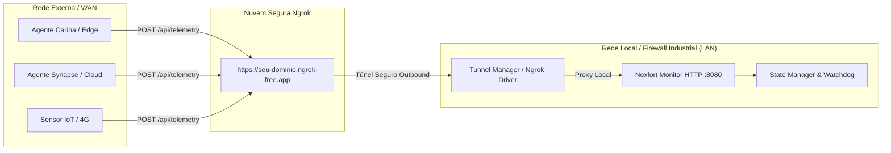

[📚 Central de Documentação](INDEX.md) > **Acesso Remoto & Ingestão via Ngrok**

---

# 🌐 Acesso Remoto & Ingestão via Túnel Ngrok: Noxfort Monitor™

Este documento descreve a arquitetura de comunicação WAN do **Noxfort Monitor™ v2.0**, cobrindo o subsistema de túnel seguro reverso via **Ngrok**, a ingestão de telemetria através da internet pública e a conexão de agentes de borda remotos (como **Synapse**, **Carina** ou nós IoT).

---

## 1. Por que Túnel Remoto em Ambientes Industriais?

Em cenários industriais e de telemetria distribuída, o servidor central do Monitor frequentemente opera dentro de uma rede local (LAN), atrás de roteadores com **NAT**, **CGNAT** de operadoras móveis ou **firewalls corporativos rigorosos** que impedem a abertura de portas de entrada (`port forwarding`).



Com o subsistema de túnel, o Noxfort Monitor abre uma conexão **outbound** (de dentro para fora) criptografada via TLS para o serviço Ngrok, expondo um ponto de extremidade público estável sem exigir IP fixo público.

---

## 2. A Camada de Abstração de Túnel (`internal/tunnel`)

Seguindo o Princípio da Inversão de Dependência (**DIP**), a camada de transporte não depende diretamente do executável do Ngrok, mas de interfaces desacopladas ([`internal/tunnel/driver.go`](../internal/tunnel/driver.go)):

```go
type Service interface {
    Start(authToken, domain string) error
    Stop() error
    GetStatus() Status
    IsBinaryAvailable() bool
}
```

### Componentes Principais:
1. **`NgrokDriver` ([`ngrok_driver.go`](../internal/tunnel/ngrok_driver.go))**:
   - Detecta a presença do binário `ngrok` no `$PATH` do sistema operacional.
   - Orquestra o ciclo de vida do processo filho (`ngrok http <porta>`).
   - Monitora o endpoint de API local do Ngrok (`http://127.0.0.1:4040/api/tunnels`) para extrair a URL pública HTTPS gerada e diagnosticar erros em tempo real.
2. **`Manager` ([`manager.go`](../internal/tunnel/manager.go))**:
   - Mantém o estado da conexão na memória (`TunnelStatus`).
   - Constrói automaticamente o endereço unificado de telemetria:
     `https://seu-dominio.ngrok-free.app/api/telemetry`
3. **`TunnelHandler` ([`tunnel_handler.go`](../internal/transport/http/tunnel_handler.go))**:
   - Expõe a interface visual em `/remote` e endpoints de controle da API.

---

## 3. Configuração & Persistência

As configurações do túnel são salvas diretamente na tabela `settings` do banco de dados ativo ([`domain.Settings`](../internal/domain/settings.go)):

| Parâmetro | Chave JSON / DB | Descrição |
| :--- | :--- | :--- |
| **AuthToken** | `ngrok_auth_token` | Token pessoal obtido no painel do Ngrok. |
| **Domínio Estático** | `ngrok_domain` | Domínio customizado ou gratuito (ex: `seu-monitor.ngrok-free.app`). |
| **Inicialização Automática** | `ngrok_enabled` | Booleano. Se `true`, o túnel inicia sozinho ao ligar o Monitor. |

### 3.1 Inicialização Automática no Boot
No arranque da aplicação ([`cmd/server/main.go:L198`](../cmd/server/main.go#L198)), o servidor avalia:
```go
if settings.NgrokEnabled && settings.NgrokAuthToken != "" {
    log.Printf("[BOOT] Auto-starting Ngrok Tunnel on domain '%s'...", settings.NgrokDomain)
    if err := tunnelManager.Start(settings.NgrokAuthToken, settings.NgrokDomain); err != nil {
        log.Printf("[WARN] Failed to auto-start Ngrok tunnel on boot: %v", err)
    }
}
```

---

## 4. Integração com Nós de Borda (Carina, Synapse, IoT)

Quando o túnel está ativo, o Monitor ajusta dinamicamente a interface do operador:
1. Na tela de **Sistemas Monitorados** (`/devices`), o endereço sugerido para os nós clientes deixa de ser o IP local (`192.168.x.x`) e passa a exibir a URL pública HTTPS do túnel.
2. O botão **"Copiar Endereço"** copia o endpoint completo pronto para ser colado nas variáveis de ambiente ou configurações dos clientes.

### Exemplo de Envio de Telemetria Remota via cURL
Nós remotos podem enviar eventos via HTTP POST padrão:

```bash
curl -X POST "https://seu-monitor.ngrok-free.app/api/telemetry" \
  -H "Content-Type: application/json" \
  -d '{
    "category": "HARDWARE",
    "origin": "carina-station-03",
    "level": "INFO",
    "message": "System OK - Telemetria via WAN",
    "occurred_at": "2026-09-05T14:30:00Z"
  }'
```

**Resposta do Servidor**:
```json
{
  "status": "received"
}
```

---

## 5. Endpoints de Controle do Túnel

| Método | Endpoint | Privilégio | Descrição |
| :--- | :--- | :--- | :--- |
| `GET` | `/remote` | Operador / Admin | Interface gráfica de gerenciamento do túnel. |
| `GET` | `/api/tunnel/status` | Autenticado | Retorna o status ao vivo (`active`, `public_url`, `error`, etc.). |
| `POST` | `/api/tunnel/save` | Admin | Salva credenciais e flags no banco de dados. |
| `POST` | `/api/tunnel/start` | Admin | Inicia o processo do túnel sob demanda. |
| `POST` | `/api/tunnel/stop` | Admin | Encerra o túnel imediatamente. |

---

### 🔗 Documentos Relacionados
* 🏗️ [Arquitetura Geral](../ARCHITECTURE.md) — Visão do fluxo de entrada de telemetria
* 📡 [Referência de APIs](API_REFERENCE.md) — Especificação detalhada de `POST /api/telemetry`
* 🗄️ [Banco de Dados & Persistência](DATABASE.md) — Estrutura da tabela `settings`
* 🔐 [Segurança e RBAC](SECURITY.md) — Proteção das APIs de configuração
* 🖥️ [Aplicação Desktop](DESKTOP_APP.md) — Acesso e monitoramento em ambiente local
