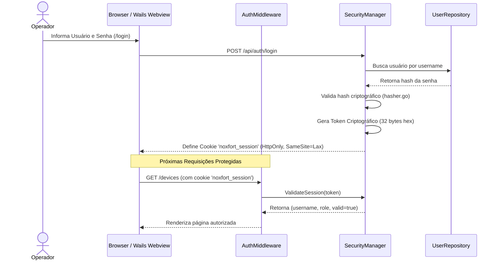

[📚 Central de Documentação](INDEX.md) > **Segurança, Autenticação & RBAC**

---

# 🔐 Segurança, Autenticação & RBAC: Noxfort Monitor™

Este documento detalha o subsistema de segurança, autenticação de operadores, controle de acesso baseado em papéis (**RBAC**), gestão de sessões e bootstrap de superusuário do **Noxfort Monitor™ v2.0**.

---

## 1. Modelo de Controle de Acesso (RBAC)

O Noxfort Monitor implementa controle de acesso rigoroso para garantir que apenas pessoal autorizado possa alterar parâmetros de alerta, cadastrar sistemas ou manipular o banco de dados.

### Papéis Disponíveis ([`internal/domain/user.go`](../internal/domain/user.go))

| Papel | Identificador | Permissões e Escopo |
| :--- | :--- | :--- |
| **Administrador** | `ADMIN` | **Acesso Total**. Gerencia usuários, configurações globais (SMTP, Telegram, Ngrok), chaveamento e migração de banco de dados, visualização de auditoria e exclusão de dispositivos. |
| **Operador** | `OPERATOR` | **Acesso Operacional**. Visualiza o Dashboard em tempo real, gerencia dispositivos e contatos de resposta a incidentes, sem permissão para alterar credenciais de banco ou criar outros administradores. |

---

## 2. Ciclo de Vida de Sessões & Autenticação

A autenticação é orquestrada pelo [`SecurityManager`](../internal/security/security_manager.go) e pelo [`SessionManager`](../internal/security/session.go):



### 2.1 Armazenamento e Transmissão de Tokens
* **Cookie Seguro**: O token de sessão é trafegado sob o nome `noxfort_session`, configurado com `HttpOnly: true`, `Path: "/"` e `SameSite: Lax`.
* **Suporte a Cabeçalho**: APIs programáticas e integrações podem enviar o token via cabeçalho HTTP:
  ```http
  Authorization: Bearer <token_de_sessao>
  ```
  ou via cabeçalho customizado `X-Session-Token: <token_de_sessao>`.
* **Sincronização no Desktop (Wails)**: Em ambientes Linux com WebKitGTK onde requisições via esquema de URI personalizado (`wails://`) podem não persistir cookies nativos automaticamente, o [`desktopResponseWriter`](../internal/desktop/app.go) intercepta os cabeçalhos de resposta `Set-Cookie` e sincroniza o token diretamente na memória da aplicação desktop.

---

## 3. Criptografia & Armazenamento de Senhas

O módulo [`internal/security/hasher.go`](../internal/security/hasher.go) isola as funções de derivação de chaves criptográficas:
* **Salt Criptográfico Aleatório**: Cada senha gerada recebe um salt exclusivo gerado via `crypto/rand`.
* **Armazenamento Protegido**: O hash resultante armazena o formato do algoritmo, custo, salt e hash final codificados em Base64 seguro.
* **Omissão em Serialização**: A entidade [`domain.User`](../internal/domain/user.go) possui a tag `json:"-"` no campo `PasswordHash`, garantindo que hashes de senha **nunca sejam expostos** em nenhuma resposta JSON da API.

---

## 4. Bootstrap Automático do Superusuário (`EnsureSuperuser`)

Para simplificar a implantação inicial sem comprometer a segurança, o sistema executa na inicialização ([`internal/security/superuser.go`](../internal/security/superuser.go)) o provisionamento idempotente da conta de administração:

1. O sistema lê as variáveis de ambiente:
   * `MONITOR_ADMIN_USER` (padrão de desenvolvimento: `admin`)
   * `MONITOR_ADMIN_PASSWORD` (padrão de desenvolvimento: `admin`)
2. Se nenhuma conta de administrador existir no banco selecionado (SQLite ou PostgreSQL), a conta é criada automaticamente com a role `ADMIN`.
3. Se o banco já possuir administradores, o sistema não sobrescreve senhas existentes a menos que explicitamente configurado.

> [!WARNING]
> **Aviso de Produção**: Em ambientes de produção, copie `.env.example` para `.env` e defina senhas complexas antes de expor o servidor à rede.

---

## 5. Middleware de Proteção HTTP (`AuthMiddleware`)

O [`AuthMiddleware`](../internal/transport/http/middleware.go) envolve a árvore de roteamento do servidor e intercepta todas as requisições:

```go
func (m *AuthMiddleware) Wrap(next http.Handler) http.Handler
```

### Regras de Interceptação:
1. **Rotas Públicas Isentas**:
   * Arquivos estáticos: `/static/*`
   * Telas de autenticação: `/login`, `/register`, `/api/auth/login`, `/api/auth/register`, `/api/auth/status`
   * **Endpoint de Ingestão de Telemetria**: `POST /api/telemetry` (isentado para permitir ingestão direta de sensores IoT e nós de borda autenticados por token de rede ou chave simétrica).
2. **Requisições de Páginas Web Desautenticadas**:
   * Requisições como `GET /`, `GET /devices` ou `GET /settings` sem sessão válida são redirecionadas com código HTTP `303 See Other` para a tela `/login`.
3. **Requisições de API Desautenticadas**:
   * Requisições como `GET /api/users` ou `POST /api/settings/database/save` sem sessão válida retornam imediatamente HTTP `401 Unauthorized` com corpo JSON:
     ```json
     {"error": "Unauthorized"}
     ```
4. **Verificação de Privilégios (RBAC)**:
   * Endpoints administrativos sensíveis (ex: `/api/users/create`, `/api/settings/database/provision-user`) exigem explicitamente `role == RoleAdmin`. Tentativas por operadores comuns retornam HTTP `403 Forbidden`.

---

## 6. Registro de Auditoria de Segurança

Toda ação sensível de segurança é comunicada ao [`AuditRepository`](../internal/storage/audit_repo.go):
* Tentativas de login (bem-sucedidas ou falhas com IP de origem).
* Criação e remoção de usuários.
* Alteração de credenciais e switches de persistência.

Consulte o documento dedicado [Trilha de Auditoria](AUDIT_TRAIL.md) para detalhes dos modelos e eventos registrados.

---

### 🔗 Documentos Relacionados
* 🏗️ [Arquitetura Geral](../ARCHITECTURE.md) — Camadas de transporte e injeção de dependência
* 🗄️ [Banco de Dados & Dual-Engine](DATABASE.md) — Tabelas de usuários e permissões no Postgres
* 📡 [Referência de APIs](API_REFERENCE.md) — Rotas `/api/auth/*` e `/api/users/*`
* 🔍 [Trilha de Auditoria](AUDIT_TRAIL.md) — Registros de segurança e logs de conformidade
* 🚀 [Guia de Implantação](DEPLOYMENT.md) — Configuração segura de variáveis de ambiente e Nginx
