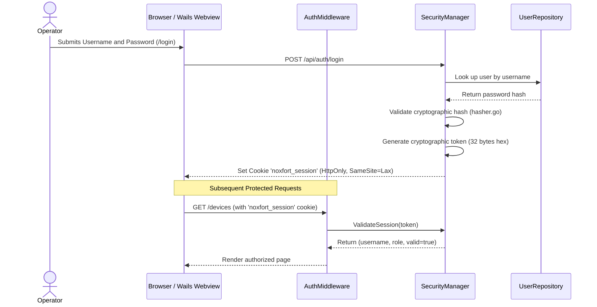

[📚 Documentation Hub](INDEX.md) > **Security, Authentication & RBAC**

---

# 🔐 Security, Authentication & RBAC: Noxfort Monitor™

This document details the security architecture, operator authentication, Role-Based Access Control (**RBAC**), session management, and superuser bootstrap mechanisms in **Noxfort Monitor™ v2.0**.

---

## 1. Access Control Model (RBAC)

Noxfort Monitor enforces strict access control to ensure that only authorized personnel can alter alert routing, register devices, or modify persistence layers.

### Available Roles ([`internal/domain/user.go`](../internal/domain/user.go))

| Role | Identifier | Permissions and Scope |
| :--- | :--- | :--- |
| **Administrator** | `ADMIN` | **Full Access**. Manages users, global settings (SMTP, Telegram, Ngrok), database switching and data migration, audit trail inspection, and device deletion. |
| **Operator** | `OPERATOR` | **Operational Access**. Views real-time dashboards, manages devices, and incident contacts, without permissions to change database credentials or create other administrators. |

---

## 2. Session Lifecycle & Authentication

Authentication is orchestrated by [`SecurityManager`](../internal/security/security_manager.go) and [`SessionManager`](../internal/security/session.go):



### 2.1 Token Storage & Transmission
* **Secure Cookie**: The session token is transported via the `noxfort_session` cookie, configured with `HttpOnly: true`, `Path: "/"`, and `SameSite: Lax`.
* **Header Support**: Programmatic APIs and integrations can transmit the token via standard HTTP headers:
  ```http
  Authorization: Bearer <session_token>
  ```
  or via the custom header `X-Session-Token: <session_token>`.
* **Desktop Synchronization (Wails)**: In Linux WebKitGTK environments where requests over custom URI schemes (`wails://`) may not persist native browser cookies automatically, [`desktopResponseWriter`](../internal/desktop/app.go) intercepts `Set-Cookie` response headers and synchronizes the token directly into desktop application memory.

---

## 3. Cryptography & Password Storage

The [`internal/security/hasher.go`](../internal/security/hasher.go) module encapsulates cryptographic key derivation:
* **Random Cryptographic Salt**: Every password generated receives an exclusive salt via `crypto/rand`.
* **Protected Storage**: The resulting hash stores algorithm identifiers, cost, salt, and final hash encoded in secure Base64.
* **Serialization Safety**: The [`domain.User`](../internal/domain/user.go) entity defines `json:"-"` on the `PasswordHash` field, guaranteeing password hashes are **never exposed** in any API JSON responses.

---

## 4. Automatic Superuser Bootstrapping (`EnsureSuperuser`)

To streamline initial deployments without compromising security, the system executes idempotent administrative account bootstrapping at startup ([`internal/security/superuser.go`](../internal/security/superuser.go)):

1. The system inspects environment variables:
   * `MONITOR_ADMIN_USER` (development default: `admin`)
   * `MONITOR_ADMIN_PASSWORD` (development default: `admin`)
2. If no administrative account exists in the active database (SQLite or PostgreSQL), the account is provisioned automatically with role `ADMIN`.
3. If administrators already exist in the database, the system will not overwrite existing credentials unless explicitly configured.

> [!WARNING]
> **Production Notice**: In production environments, copy `.env.example` to `.env` and configure strong credentials prior to exposing the server to the network.

---

## 5. HTTP Protection Middleware (`AuthMiddleware`)

[`AuthMiddleware`](../internal/transport/http/middleware.go) wraps the server routing tree and intercepts all incoming requests:

```go
func (m *AuthMiddleware) Wrap(next http.Handler) http.Handler
```

### Interception Rules:
1. **Exempt Public Routes**:
   * Static assets: `/static/*`
   * Authentication endpoints: `/login`, `/register`, `/api/auth/login`, `/api/auth/register`, `/api/auth/status`
   * **Telemetry Ingestion Endpoint**: `POST /api/telemetry` (exempt to facilitate direct ingestion from IoT sensors and edge field nodes).
2. **Unauthenticated Web Page Requests**:
   * Navigations such as `GET /`, `GET /devices`, or `GET /settings` without a valid session redirect with HTTP `303 See Other` to `/login`.
3. **Unauthenticated API Requests**:
   * Requests such as `GET /api/users` or `POST /api/settings/database/save` without a valid session immediately return HTTP `401 Unauthorized`:
     ```json
     {"error": "Unauthorized"}
     ```
4. **Privilege Enforcement (RBAC)**:
   * Sensitive administrative endpoints (e.g., `/api/users/create`, `/api/settings/database/provision-user`) strictly require `role == RoleAdmin`. Attempts by standard operators return HTTP `403 Forbidden`.

---

## 6. Security Audit Logging

All sensitive security actions are logged to [`AuditRepository`](../internal/storage/audit_repo.go):
* Login attempts (successful logins and failures with client IP).
* User account creation and removal.
* Modification of notification credentials and persistence switching.

Refer to [Audit Trail](AUDIT_TRAIL.md) for full audit schema and event specifications.

---

### 🔗 Related Documentation
* 🏗️ [System Architecture](../ARCHITECTURE.md) — Transport layers and dependency injection
* 🗄️ [Database & Dual-Engine](DATABASE.md) — User tables and PostgreSQL permissions
* 📡 [API Reference](API_REFERENCE.md) — `/api/auth/*` and `/api/users/*` routes
* 🔍 [Audit Trail](AUDIT_TRAIL.md) — Security logs and compliance records
* 🚀 [Deployment Guide](DEPLOYMENT.md) — Secure environment variables and NGINX configuration
