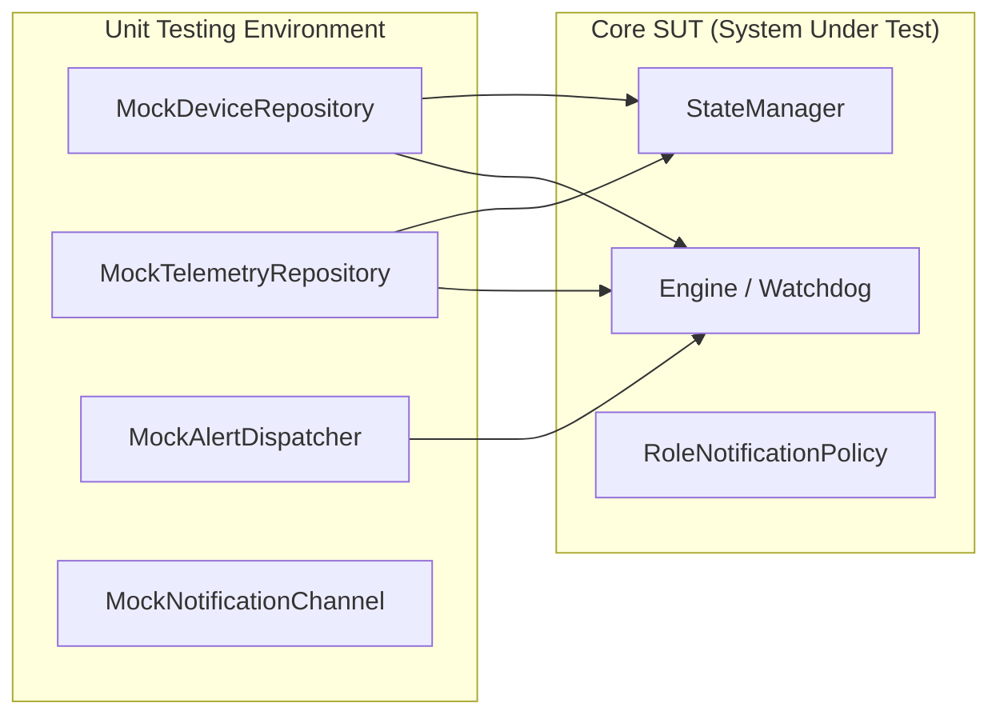

[📚 Documentation Hub](INDEX.md) > **Testing & Quality Assurance (QA)**

---

# 🧪 Testing & Quality Assurance (QA): Noxfort Monitor™

This document outlines the testing standards and procedures for **Noxfort Monitor™ v2.0**, including running the automated unit test suite, integration testing with in-memory mocks, manual end-to-end (**E2E**) verification via **MQTT** and **HTTP cURL**, and notification channel diagnostics.

---

## 1. Running the Automated Test Suite

The project maintains comprehensive unit test coverage across all internal packages (`internal/monitor`, `internal/security`, `internal/storage`, `internal/transport/http`, `internal/desktop`, `internal/protocol`, `internal/tunnel`).

To execute all automated tests with verbose reporting:
```bash
make test
```
*Under the hood, the Makefile runs `go test ./... -v`.*

---

## 2. Testing Philosophy & In-Memory Mocks

Thanks to strict Dependency Injection (**DI**) across the codebase, core logic tests (`internal/monitor` and `internal/security`) do not depend on on-disk databases or external running daemons:



### What Is Validated in Automated Tests:
* **Smart Heartbeat Filter ([`state_test.go`](../internal/monitor/state_test.go))**: Confirms that `INFO` messages containing keep-alive keywords update presence timestamps without creating incidents or dispatching alerts.
* **Watchdog Timing & Outage Detection ([`engine_test.go`](../internal/monitor/engine_test.go))**: Simulates devices silent for more than 5 minutes, ensuring the Engine synthesizes the `CRITICAL` `System OFFLINE` event and the subsequent `System ONLINE` recovery event.
* **Role-Based RBAC Routing ([`router_test.go`](../internal/monitor/router_test.go))**: Confirms that `HARDWARE` alerts are routed strictly to technicians/admins, and `SOFTWARE` alerts strictly to programmers/admins.
* **Cryptography & Sessions ([`hasher_test.go`](../internal/security/hasher_test.go), [`session_test.go`](../internal/security/session_test.go))**: Verifies secure salted password hashing and session token expiration.
* **Database Hot-Reload ([`db_manager_test.go`](../internal/storage/db_manager_test.go))**: Validates live connection switching without closing active repository consumers.

---

## 3. Manual E2E Testing

### 3.1 MQTT Ingestion Test (`mosquitto_pub`)
Ensure the local broker is running (`make broker-start`):

#### 1. Simulate Normal Heartbeat (Keep-alive)
```bash
mosquitto_pub -t "noxfort/devices/pump-01/telemetry" -m '{
  "category": "HARDWARE",
  "origin": "pump-01",
  "level": "INFO",
  "message": "System OK",
  "occurred_at": "2026-09-05T10:00:00Z"
}'
```
*Expected Result*: Device `pump-01` updates its `last_seen` timestamp. No alert is dispatched and no unneeded record is added to `telemetry_logs`.

#### 2. Simulate Critical Hardware Incident
```bash
mosquitto_pub -t "noxfort/devices/pump-01/telemetry" -m '{
  "category": "HARDWARE",
  "origin": "pump-01",
  "level": "CRITICAL",
  "message": "Pressure Valve Failure: Pressure 120 PSI",
  "occurred_at": "2026-09-05T10:05:00Z"
}'
```
*Expected Result*: Event is persisted in `telemetry_logs`, appears on the Web Dashboard, and immediately dispatches alerts to contacts with `TECHNICIAN` and `ADMIN` roles.

---

### 3.2 HTTP REST Ingestion Test (`cURL`)
To validate the `POST /api/telemetry` route utilized by remote edge agents:

```bash
curl -X POST http://localhost:8080/api/telemetry \
  -H "Content-Type: application/json" \
  -d '{
    "category": "SOFTWARE",
    "origin": "synapse-node-02",
    "level": "WARNING",
    "message": "RAM consumption exceeded 80%",
    "occurred_at": "2026-09-05T17:10:00Z"
  }'
```
*Expected Result*: HTTP `200 OK` response with `{"status":"received"}` and incident logged on the Dashboard.

---

## 4. Notification Channel Diagnostics

The [`ChannelTester`](../internal/monitor/tester.go) module enables on-demand validation of notification credentials without triggering false incidents:

* **SMTP Test (Email)**: On the UI Settings tab (`/settings`) or via `POST /settings/test`, the system sends a verification email to administrators.
* **Telegram Test**: On the `/settings` screen or via `POST /settings/test-telegram`, the system formats and transmits a MarkdownV2 test message to the configured chat.

---

### 🔗 Related Documentation
* 🏗️ [System Architecture](../ARCHITECTURE.md) — Isolation philosophy and dependency injection
* 📡 [API Reference](API_REFERENCE.md) — JSON payload specifications
* 👨‍💻 [Developer Guide](DEVELOPER_GUIDES.md) — Local environment and build steps
* 🔍 [Audit Trail](AUDIT_TRAIL.md) — Alert dispatch test logs and delivery statuses
