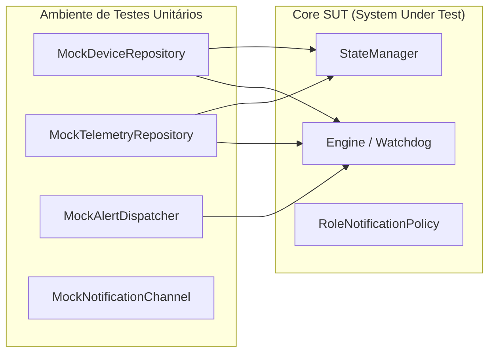

[📚 Central de Documentação](INDEX.md) > **Testes & Garantia de Qualidade (QA)**

---

# 🧪 Testes & Garantia de Qualidade (QA): Noxfort Monitor™

Este documento descreve os padrões e procedimentos de teste do **Noxfort Monitor™ v2.0**, incluindo a execução da suíte de testes unitários automatizados, testes de integração com mocks, testes manuais de ponta a ponta (**E2E**) via **MQTT** e **HTTP cURL**, e diagnósticos de canais de alerta.

---

## 1. Executando a Suíte Automatizada

O projeto conta com ampla cobertura de testes unitários em todos os pacotes internos (`internal/monitor`, `internal/security`, `internal/storage`, `internal/transport/http`, `internal/desktop`, `internal/protocol`, `internal/tunnel`).

Para rodar todos os testes automatizados com relatório verboso:
```bash
make test
```
*Nos bastidores, o Makefile executa `go test ./... -v`.*

---

## 2. Filosofia de Testes & Mocks em Memória

Graças à estrita Injeção de Dependências (**DI**) implementada no projeto, os testes do núcleo lógico (`internal/monitor` e `internal/security`) não dependem de bancos de dados em disco ou serviços externos rodando:



### O Que É Validado nos Testes Automatizados:
* **Filtro Inteligente de Heartbeats ([`state_test.go`](../internal/monitor/state_test.go))**: Garante que mensagens `INFO` com termos de keep-alive atualizem o timestamp sem gerar incidentes nem disparar alertas.
* **Watchdog Timing & Detecção de Queda ([`engine_test.go`](../internal/monitor/engine_test.go))**: Simula sistemas sem comunicação além de 5 minutos, garantindo que o Engine sintetize o evento `CRITICAL` `System OFFLINE` e o subsequente `System ONLINE` de recuperação.
* **Roteamento RBAC por Função ([`router_test.go`](../internal/monitor/router_test.go))**: Confirma que alertas `HARDWARE` são direcionados apenas a técnicos/administradores, e alertas `SOFTWARE` apenas a programadores/administradores.
* **Criptografia & Sessões ([`hasher_test.go`](../internal/security/hasher_test.go), [`session_test.go`](../internal/security/session_test.go))**: Valida o hashing seguro com salt e expiração de sessões.
* **Hot-Reload de Banco ([`db_manager_test.go`](../internal/storage/db_manager_test.go))**: Valida a troca da conexão sem fechar repositórios em uso.

---

## 3. Testes Manuais E2E

### 3.1 Teste de Ingestão via MQTT (`mosquitto_pub`)
Certifique-se de que o broker está ativo (`make broker-start`):

#### 1. Simular Batimento Cardíaco Normal (Keep-alive)
```bash
mosquitto_pub -t "noxfort/devices/pump-01/telemetry" -m '{
  "category": "HARDWARE",
  "origin": "pump-01",
  "level": "INFO",
  "message": "System OK",
  "occurred_at": "2026-09-05T10:00:00Z"
}'
```
*Resultado Esperado*: O dispositivo `pump-01` atualiza o campo `last_seen`. Nenhum alerta é emitido e nenhum registro suja a tabela `telemetry_logs`.

#### 2. Simular Incidente Crítico de Hardware
```bash
mosquitto_pub -t "noxfort/devices/pump-01/telemetry" -m '{
  "category": "HARDWARE",
  "origin": "pump-01",
  "level": "CRITICAL",
  "message": "Falha na Válvula de Pressão: Pressão 120 PSI",
  "occurred_at": "2026-09-05T10:05:00Z"
}'
```
*Resultado Esperado*: O evento é salvo na tabela `telemetry_logs`, surge no Dashboard Web e dispara notificações imediatas para contatos com função `TECHNICIAN` e `ADMIN`.

---

### 3.2 Teste de Ingestão via HTTP REST (`cURL`)
Para validar a rota `POST /api/telemetry` utilizada por agentes de borda remotos:

```bash
curl -X POST http://localhost:8080/api/telemetry \
  -H "Content-Type: application/json" \
  -d '{
    "category": "SOFTWARE",
    "origin": "synapse-node-02",
    "level": "WARNING",
    "message": "Consumo de memória RAM ultrapassou 80%",
    "occurred_at": "2026-09-05T17:10:00Z"
  }'
```
*Resultado Esperado*: Resposta HTTP `200 OK` com `{"status":"received"}` e registro do incidente no Dashboard.

---

## 4. Diagnóstico de Canais de Alerta

O módulo [`ChannelTester`](../internal/monitor/tester.go) permite validar credenciais de notificação sob demanda sem gerar incidentes falsos:

* **Teste SMTP (Email)**: Na aba Configurações da UI (`/settings`) ou via `POST /settings/test`, o sistema envia um email de verificação aos administradores.
* **Teste Telegram**: Na tela `/settings` ou via `POST /settings/test-telegram`, o sistema formata e envia uma mensagem MarkdownV2 para o chat informado.

---

### 🔗 Documentos Relacionados
* 🏗️ [Arquitetura Geral](../ARCHITECTURE.md) — Filosofia de isolamento e injeção de dependências
* 📡 [Referência de APIs](API_REFERENCE.md) — Especificação dos payloads JSON
* 👨‍💻 [Guia do Desenvolvedor](DEVELOPER_GUIDES.md) — Instruções para rodar localmente
* 🔍 [Trilha de Auditoria](AUDIT_TRAIL.md) — Registros dos testes de alerta e status de entrega
